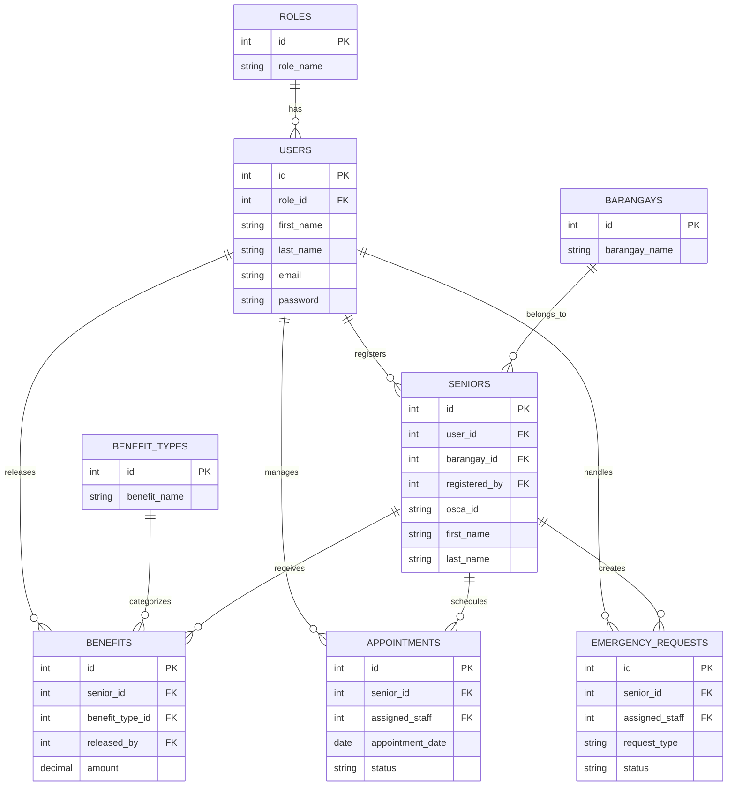

# Entity Relationship Diagram (ERD)

# ElderEase

## Web-Based Senior Citizen Assistance and Benefits Management System

---

## Project Scope

Current deployment:

- San Fernando City, La Union

Future expansion:

- Multi-LGU support

---

## Entity Relationship Diagram

---

## Database Design Principles

- Third Normal Form (3NF)
- Referential Integrity
- Foreign Key Constraints
- Scalable Architecture
- Timestamp Tracking
- Future-ready for Senior Citizen Portal

---

## Version

1.1